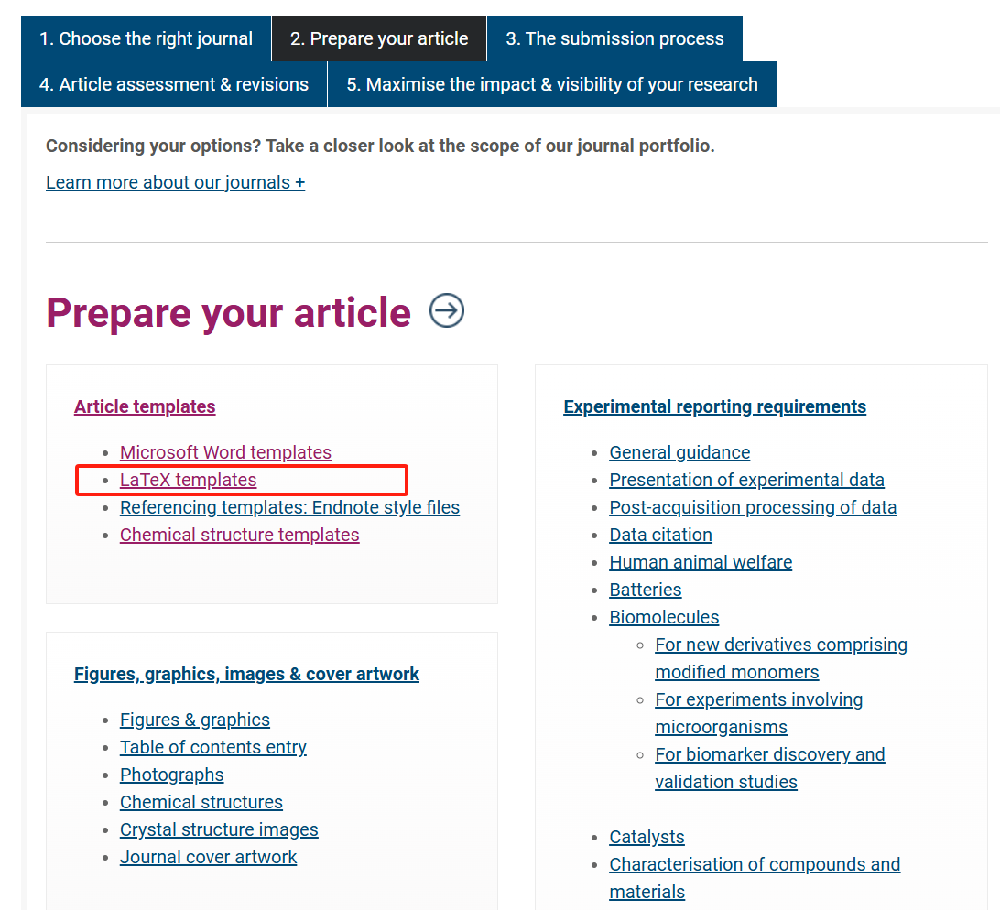
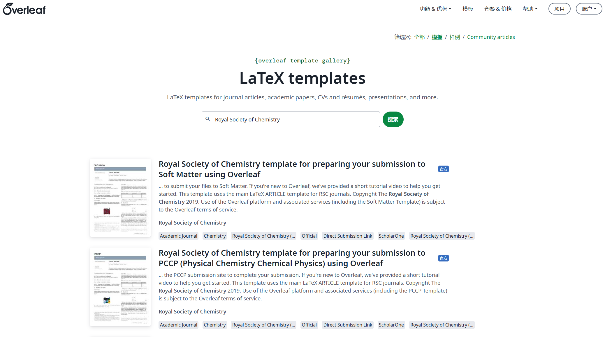
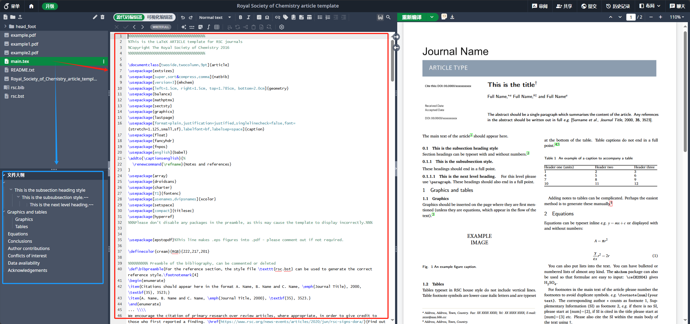

如果你熟悉一门编程语言以及 Markdown 标记语言，使用 Latex 投稿文章是一个不错的选择。

## 一、期刊官网下载模板

1. 因为我投的期刊出版社是英国皇家化学会（RCS），所以下载模板的地址为：[RSC文章投稿指南](https://www.rsc.org/journals-books-databases/author-and-reviewer-hub/authors-information/#prepare-article)。里面有 Latex、Word、Chemdraw文件的模板，我们下载 Latex，是一个 zip 包
   

2. zip 包中的文件有如下文件：
   
   ```sh
   royal-society-of-chemistry-article-template.zip
   └ head_foot        # 出版社图片/格式文件，不用动
    └ dates.pdf
    └ DOI.pdf
    └ header_bar.pdf
    └ journal_name.pdf
    └ LF.pdf
    └ RF.pdf
    └ RSC_LOGO_CMYK.eps
    └ RSC_LOGO_CMYK.pdf
    └ RSC_pub.pdf
   └ example.pdf        # main.tex 中的示例图片，可删除。
   └ example1.pdf        # main.tex 中的示例图片，可删除。
   └ example2.pdf        # main.tex 中的示例图片，可删除。
   └ main.tex            # Latex 文件，文章正文，是我们主要编辑的文件
   └ README.txt        # 使用指南
   └ Royal_Society_of_Chemistry_article_template.pdf    # 使用 main.tex 预编译的 pdf 文件，可删除。
   └ rsc.bib            # 引用文献，需要编辑
   └ rsc.bst            # 引用文献参考格式，不用动
   ```

## 二、 在本地或在线编辑 Latex 文件

1. 本地编辑需要安装 Latex 环境（[texlive](https://mirrors.tuna.tsinghua.edu.cn/CTAN/systems/texlive/ "https://mirrors.tuna.tsinghua.edu.cn/CTAN/systems/texlive/")）和软件（[TexStudio](https://mirrors.tuna.tsinghua.edu.cn/github-release/texstudio-org/texstudio/ "https://mirrors.tuna.tsinghua.edu.cn/github-release/texstudio-org/texstudio/")），网上有很多教程，这里不再赘述。我推荐使用在线编辑 Latex 网站 [Overleaf](https://cn.overleaf.com/ "https://cn.overleaf.com/")，不需要配置环境和软件，只需要注册账号即可。Overleaf 有在线的模板，也可使用下载的 royal-society-of-chemistry-article-template.zip 创建项目。
   ​​

2. 使用模板创建项目后，使用 Overleaf 在线编辑 main.tex 文件，如所示，左边是文件结构和文件内容大纲，中间是工作区，右边是编译的 pdf 预览图。由于 Latex 排版是所见和所得相分离，我们编辑 main.tex 完查看效果需要编译才能看到更改后的 pdf 文件效果。
   
   ​​

3. 理解 main.tex 模板文件，在文件中出版商已经写好了每部分的格式和内容，用 %%%% 分隔，格式部分会注明：`Please do not change any commands within this section`​。main.tex 文件每个部分包括：
   
   ```txt
   %%%%%%%%%%%%%%%%%%%%%%%%%%%%%%%%%%%
   %This is the LaTeX ARTICLE template for RSC journals
   %Copyright The Royal Society of Chemistry 2016
   %%%%%%%%%%%%%%%%%%%%%%%%%%%%%%%%%%%
   ......         # 不要禁用任何在导言区（preamble）加载的包，不用动
   %%%Please don't disable any packages in the preamble, as this may cause the template to display incorrectly.%%%%
   ......        # 不要禁用任何在导言区（preamble）加载的包，不用动
   %%%%%%%%% Preamble of the bibliography, can be commented or deleted
   ......        # 参考文献部分，我们在 rsc.bib 文件中编辑，这里
   \begin{document}
   .......        # 文档的开始，所有的正文内容将从这里开始
   %%%HEADER%%%
   .......        # 页眉设置：页眉包含期刊的名称、期刊的 LOGO 等元素
   %%%PAGE SETUP - Please do not change any commands within this section%%%
   .......        # 页面设置：定义了文档的页面布局，例如边距、字体大小、行间距等设置。
   %%%FOOTER%%%
   .......        # 页脚设置：定义了页脚内容，包括页码、版权信息、期刊标识等。
   %%%FIGURE SETUP - please do not change any commands within this section%%%
   .......        # 图形设置：定义了图形的排版方式，例如图形插入时的间距、图形边框等。
   %%%TITLE, AUTHORS AND ABSTRACT%%%
   .......        # 需要编辑的标题、作者和摘要部分
   %%%FONT SETUP - please do not change any commands within this section
   .......        # 字体设置：定义了文档中使用的字体、大小、样式等。
   %%%FOOTNOTES%%%
   .......        # 脚注：定义文章中的脚注。常用提供附加信息或解释，如作者的机构、通讯作者的联系方式、补充信息等。
   %%%MAIN TEXT%%%%
   .......        # 正文部分：文章的核心部分。
   %%%REFERENCES%%%
   .......        # 参考文献设置，使用 BibTeX 文件来管理参考文献
   \end{document}        # 结束文档
   ```

4. 将 Word 编辑完的手稿填入 main.tex 文件中。可以看出，我们只需要编辑：标题作者摘要部分、脚注部分、正文内容、参考文献（rsc.bib 文件） 这四个部分。main.tex 文件中已经贴心的写好了很多部分的注释，以 % 开头，比如 `%The abstrast goes here instead of the text "The abstract should be..."` 只需要按照提示，将模板中的内容替换掉即可。
   
   > 也可将写好的 Word 手稿使用文件转换为 Latex 格式，有很多在线网站和软件又可以使用。

## 三、对内容格式的简单介绍

对于熟悉 Markdown 标记语言的人来说，Latex 有很多相同的地方，一般投稿文章需要文本、图片、表格、公式、代码等元素，这里简做介绍。

1. 文本正常输入即可，有些符号需要加转义符号 `\`​ 才能正常显示，比如 `%`​ 在 Latex 中表示 注释，需要加 `\%`​ 才能显示为 `%`​ ，此外，还有加粗`\textbf{加粗}`​ 、斜体`\textit{斜体}`​、上标`^`​、下标`_`​、下划线`\underline{带下划线}`​等等格式，可以询问 GPT。

2. 图片：有单列图和全宽图，图片文件格式为 .pdf 或者 .eps（使用 PhotoShop 或者 AdobePDF 可导出）
   
        \begin{figure}[h]
            \centering
            \includegraphics[width=0.5\textwidth]{example-image.pdf} % 替换为你的图片路径
            \caption{这是一个例子图片。}
            \label{fig:example1}
        \end{figure}
   
   如果在 Figure 标签中插入一张 Scheme 图片（比如合成路线一般用 Scheme ）则可以插入如下内容：
        
        \begin{figure*}[h]
             \centering
             \renewcommand{\figurename}{Scheme}   # 将标签从 Fig 改为 Scheme
             \addtocounter{figure}{-1}            # 将图形计数器减 1，用于覆盖自动编号
             \includegraphics[width=0.8\linewidth]{Scheme1.pdf}
             \caption{Synthetic routes for A and B.}
             \label{Scheme1}
        \end{figure*}


3. 表格：有单列表格和全宽表格
   
        \begin{table}[h]
            \centering
            \begin{tabular}{|c|c|}
                \hline
                列1 & 列2 \\
                \hline
                数据A & 数据B \\
                数据C & 数据D \\
                \hline
            \end{tabular}
            \caption{这是一个例子表格。}
            \label{tab:example1}
       \end{table}

4. 公式：分为行内公式 `$$` 和独立公式

5. 代码：行内代码和独立代码
   
       \begin{lstlisting}[language=Python, caption=Python 示例代码, label=lst:python_example]
        print("Hello, world!")
       \end{lstlisting}

## 四、插入参考文献

使用任何可以生成 BibTeX 格式的参考文献文件，将内容复制到 rsc.bib 文件中然后编译完成后，在 main.tex 使用 `\cite{}` 命令引用文献，Latex 会自动生成序号以及 Bibliography。这时候还需要仔细检查格式，会有如下情况：

出版社会提供统一的 Latex 模板，但是出版社旗下的不同期刊可能对参考文献的格式要求不同，比如：参考文献需要期刊名称为缩写，这时候导出的 bibtex 文件中的期刊名称字段需要修改。以及需要显示文章标题，这时候就需要修改 rsc.bst 参考文献格式文件中的内容。

例：参考文献显示文章标题

FUNCTION {article}
{ output.bibitem
  format.authors "author" output.check
  title format.title.noemph "title" output.check 
  journal emphasize "journal" output.check
  format.date "year" output.check
  volume empty$
    { "" format.pages.nopp output }
    { format.vol.pages output }
  if$
  format.doi
  fin.entry
}

这个就是修改参考文献文章类型的字段，可以调整每个元数据的位置，显示活隐藏某个部分。


## 五、投稿提交文件

和使用 Word 投稿不同的地方在于，Manuscript 部分上传的不是 docx 而是编译好的 pdf 文件，然后再最后加上每个 figure.pdf 文件和  Latex support file （main.tex 和 rsc.bib）


‍
