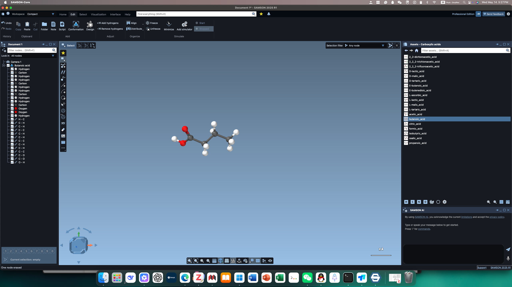
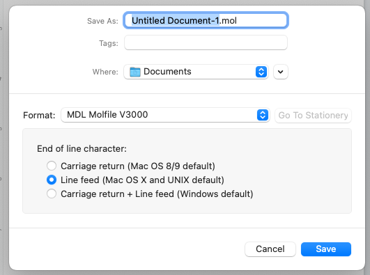
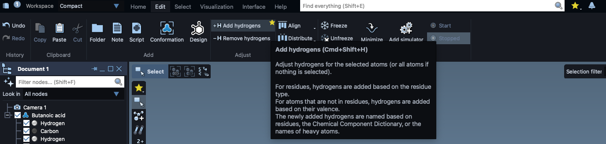
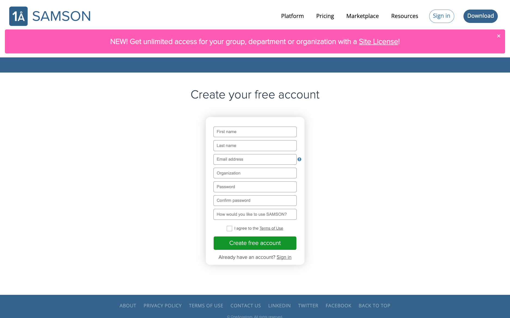
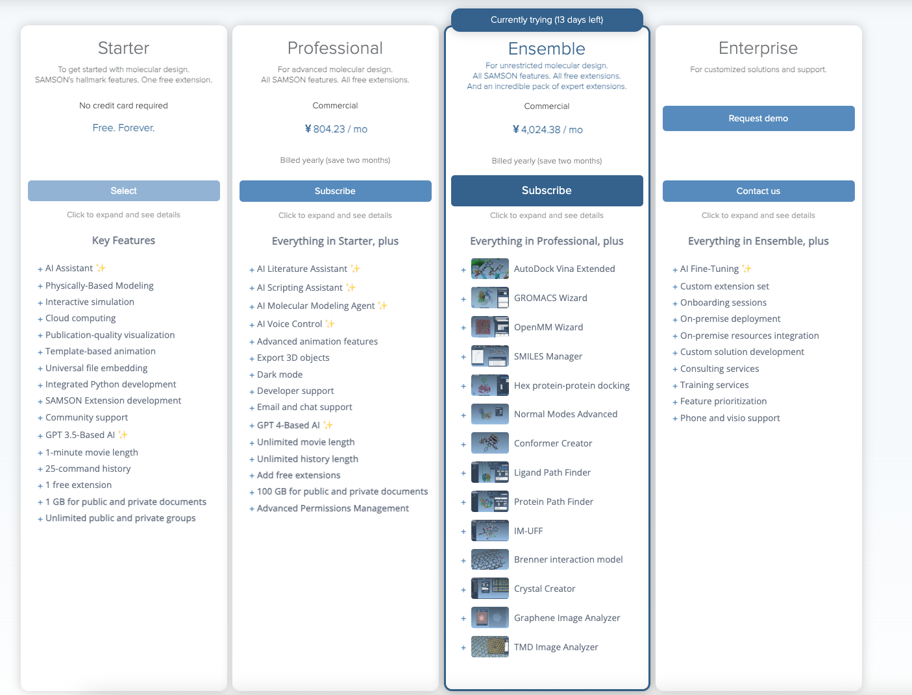

众所周知，Mac OS 上的科研软件是不多的，尤其是比较专业的软件。最近无意间发现一款化学/生物结构的 3D 建模软件 SANSON，由 [OneAngstrom](https://oneangstrom.com/) 开发，可以原生支持 Mac OS，而且基本功能（Starter 版本）是免费使用，功能强大。可以说是 Chemdraw 3D 的平替。

## 一、简单介绍

话不多说，先上界面图：

​​

软件更新很及时的，我下载的就是2025 R1 (7.0.0) 版本。整体界面和 Windows 风格差不多：

1）顶部菜单栏：主页、编辑、选择工具、可视化设置、界面设置、帮助文档。  
2）左侧 Document View ：对分子结构的元数据进行展示：原子和键的信息。  
3）中央工作区：当前选中的分子结构的3D模型。  
4）底部快捷工具栏：一些快捷工具按钮，用于快速访问常用功能。  
5）右侧是一些多样的功能窗口，常驻的是分子结构资源库，可以直接将分子结构添加到中央工作区。除此之外，还会有 SANSON AI 工具，Python Console （暂时不知道脚本可以干嘛）等等。

我使用这个软件主要是用来分子建模，预优化分子结构，用于后续的 Gaussian 计算。这个不能像 Windows 下 Chemdraw 和 Chemdraw 3D 连用（也就是 Chemdraw 绘制的结构直接粘贴过来）。但是可以在 Chemdraw 中将绘制的结构另存为 .mol 格式（MDL Molfile V3000）。

​

然后使用 SANSON 软件打开刚才 Chemdraw 另存为的 .mol 文件，先点击 Add hydrogen ，将结构加上 H 原子，然后再点击 MInimize 优化结构构象。另存为 pdb/mol2/xyz 就可以得到分子的笛卡尔坐标了。

​

补充一下，在没有发现这个软件之前，Mac OS 建立分子 3D 结构我用的 openbabel 软件，在 Mac OS 终端里将 .mol 文件转为 pdb/mol2/xyz ，openbabel 软件也支持 Add hydrogen 以及利用分子力场优化结构，但是没有可视化窗口，不太直观，也不方便调整结构细节。SANSON 可以说是很好的补充了。

## 二、获取方式

### 1. 注册账号

注册网站：[https://www.samson-connect.net/signUp](https://www.samson-connect.net/signUp) ，填写名字、邮箱、密码、使用 SANSON 原因（随便填，我就填了一个 build molecular）

​​

申请完账户还会给你 1 GB 的云文档使用空间，不过我没用过。申请结束后在网站的右上角会显示你的账户名称，鼠标移动到上面选择 Setting，然后就可以看到你的邮箱 和 SAMSON Key 了，SAMSON SDK Key是开发者用的，我们不用管。

### 2. 下载应用

在网站最右上角有 Download，会自动下载你所在的平台安装包，Mac OS 下载的就是 SAMSON-Setup.dmg 格式，双击打开 dmg ，然后不用着急将安装包 拖到 应用文件夹中（安装包只有 14 MB 肯定不是主程序），直接双击这个程序，程序会自动下载所有文件到 应用文件夹下的。期间会让你输入 邮箱地址和 SAMSON Key

## 三、补充

SAMSON 软件使用指南：[https://documentation.samson-connect.net/users/7.0.0/](https://documentation.samson-connect.net/users/7.0.0/)

这个软件高级版也是贵的离谱，Ensemble 版本 ￥4,829.41 / 月，这里放个图：

​​

Professional 版本：可以添加一些免费的扩展，100 GB 的云空间、高级权限管理等等

Ensemble 版本：

- AutoDock Vina Extended、GROMACS Wizard、OpenMM Wizard 等专业分子设计工具。
    
- SMILES Manager、Hex蛋白-蛋白对接、正常模式高级分析等高级分子建模工具。
    
- Conformer Creator、配体路径查找器、蛋白质路径查找器等高级分子结构分析工具。
    
- IM-UFF、Brenner相互作用模型、晶体创建器等高级分子模拟工具。
    
- 石墨烯图像分析器、TMD图像分析器等高级材料科学工具。
