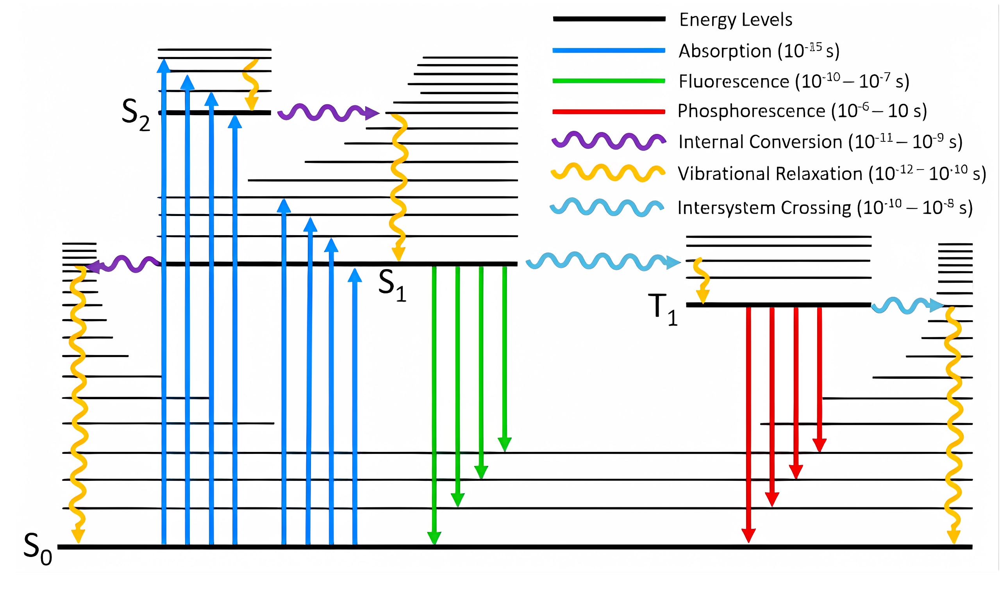

## 一、概要

1. 根据 Jablonski Diagram，分子收到激发到达不同的激发态能级后，会经历一系列激发态过程，包括振动弛豫（`Vibrational Relaxation, VR`）、内转换（`Internal Conversion, iC`）、系间窜跃（`Intersystem Crossing, ISC`）、反系间窜跃（`Reverse Intersystem Crossing, RISC`）、荧光（`Fluorescence, Fl`）、磷光过程（`Phosphorescence, Phos`）。这一系列过程被统称为激发态动力学。


2. 量子化学计算可以对多数激发态过程进行模拟计算，常用的软件比如 Gaussian、Orca、MOMAP、FCclasses等。本文记录了一些常见的激发态动力学计算，主要计算 内转换速率（`k_IC`）、荧光辐射速率（`k_r`）、系间窜跃和反系间穿越窜跃速率（`k_ISC, k_RISC`）。

3. 补充额外的知识，玻尔兹曼热布居进行加权：假设 n 个态的能量为 \\(E_0、E_1、E_2、...E_n\\)，每个态的简并度为 \\(g_i\\) ，则每个态分布的粒子数比例为：


<div>$$
g_0:g_1e^{\frac{E_1-E_0}{kT}}:g_2e^{\frac{E_2-E_0}{kT}}:g_3e^{\frac{E_3-E_0}{kT}}:g_4e^{\frac{E_4-E_0}{kT}}....:g_ne^{\frac{E_n-E_0}{kT}}=q_1:q_2:q_3:q_4....:q_n
$$<div>

    假设：对第 2 个态进行加权计算数值：

<div>$$
\dfrac{q_2}{q_1+q_2+q_3...+q_n}*N_2
$$<div>

    对总数 N 进行玻尔兹曼加权平均 ：

<div>$$
\dfrac{1}{\bar{N}}=\dfrac{q_1}{\sum q_n}*\dfrac{1}{N_1}+\dfrac{q_2}{\sum q_n}\dfrac{1}{N_2}....+\dfrac{q_n}{\sum q_n}\dfrac{1}{N_n}
$$<div>

## 二、具体计算的过程

### 1. 荧光辐射速率 （`k_r`）

1）借助量化程序，优化 S1 态的极小点结构，得到 S1 的振子强度 f 和 激发态能级 E，然后根据爱因斯坦自发辐射速率公式推导得到的：

<div>$$
k=\frac{f·E^2}{1.499}
$$<div>

 举例：S1 激发能为 0.19847 hartree \= 0.19847 x 2.1947 x  10<sup>5</sup>  cm<sup>-1</sup> \= 43558 cm<sup>-1</sup>，f \= 0.3808 。因此 τ \= 1.499/ (0.3808\*43558<sup>2</sup> ) \= 0.2075 x 10<sup>-8</sup> s，因此辐射跃迁速率为 1/τ \= 4.82 x 10<sup>8</sup> s<sup>-1</sup> 。


2）使用 FCclasses3 计算辐射跃迁速率（Orca、MOMAP 也可以计算，具体参考文档）

假设研究 S1 到 S0 的辐射跃迁速率：使用 Gaussian 分别优化计算两个态得到极小点结构，并保存 fchk 波函数文件。这里假设为 S1.fchk 和 S0.fchk

使用 FCclasses 将 fchk 文件转为 state_file 文件 dipfile_file （非绝热耦合矢量）文件，其中 state_file 需要 S1 和 S0 都需要转换，eldip_file 只需要 S1 的 fchk 进行转换。

```
gen_fcc_state -i S1.fchk
gen_fcc_state -i S1.fchk
gen_fcc_dipfile -i S1.fchk
```
编写 FCclasses 计算输入文件，fcc.inp

```
$$$
PROPERTY     =   EMI  ; OPA/EMI/ECD/CPL/RR/TPA/TPCD/MCD/IC/NRSC
MODEL        =   AH   ; AS/ASF/AH/VG/VGF/VH
DIPOLE       =   FC   ; FC/HTi/HTf
TEMP         =   298.15 ; (temperature in K)
;DE           = (read) ; (adiabatic/vertical energy in eV. By default, read from state files)
BROADFUN     =   GAU  ; GAU/LOR/VOI
HWHM         =   0.01 ; (broadening width in eV)
METHOD       =   TD   ; TI/TD
;VIBRATIONAL ANALYSIS
NORMALMODES  =   COMPUTE   ; COMPUTE/READ/IMPLICIT
COORDS       =   CARTESIAN ; CARTESIAN/INTERNAL
;INPUT DATA FILES
STATE1_FILE  =   S1.fcc    ; 状态 s1 的 fcc 文件
STATE2_FILE  =   S0.fcc          ; 状态 s0 的 fcc 文件
ELDIP_FILE   =   eldip_S1_fchk ; 状态 s1 的 偶极子 文件
```
运行 fcclasses3 fcc.inp 就可以得到 fcc.out 文件，搜索 rate 就会有：`kr constant (s-1) 9.028E+08​`  

### 2. 磷光辐射速率：`（k_p）`

 
磷光辐射速率在不考虑 T1 和 S0 之间自旋轨道耦合（SOC）情况下，振子强度为 0（也就是不发光），考虑自旋轨道耦合的振子强度需要通过量化程序得到 <T1|SOC|S0> 的数值，然后额外接触其他程序得到振子强度来计算磷光辐射速率。
    

三重态的三个分态的寿命和辐射跃迁速率是不一样的。如果没有其他的跃迁机理，三个三重态都直接跃迁到基态S0，那么观察到的辐射寿命就是从三个态的平均跃迁速率得到的：\\(τ^{av}=\dfrac{3}{k_1+k_2+k_3}\\) （参考 Phys.Chem.Chem.Phys., 2014, 16, 14523 ）。更严格的，是将辐射跃迁寿命根据能量进行玻尔兹曼平均得到的。
    

<div>$$
\tau^{a v}=\frac{1+e^{-\left(\Delta E_{1,2} / k_{B} T\right)}+e^{-\left(\Delta E_{1,3} / k_{B} T\right)}}{1 / \tau_{1}+e^{-\left(\Delta E_{1,2} / k_{B} T\right)} / \tau_{2}+e^{-\left(\Delta E_{1,3} / k_{B} T\right)} / \tau_{3}}
$$<div>

Orca 计算磷光辐射跃迁速率，需要基态和激发三线态的 hess 文件，输入文件如下：

```bash
# 基态 S0.inp
! PBE0 def2-SVP OPT FREQ
%pal nprocs 40
     end
%MaxCore 2560
* xyz 0 1
*

# 激发三线态 T1.inp
! PBE0 def2-SVP OPT FREQ
%TDDFT
  NROOTS 5
  IROOTMULT TRIPLET
END
%pal nprocs 8
     end
%MaxCore 2560
* XYZFILE 0 1 S0.xyz
```

顺序提交计算结束后文件夹下出现 S0.hess 和 T1.hess 文件，然后编辑 Phos.inp

```bash
!B3LYP DEF2-TZVP(-F) TIGHTSCF CPCM(ETHANOL) ESD(PHOSP) RI-SOMF(1X)
%TDDFT
NROOTS 10
DOSOC TRUE
TDA FALSE
IROOT 1
END
%ESD
GSHESSIAN "S0.hess"
TSHESSIAN "T1.hess"
DOHT TRUE
DELE 17260
END
%pal nprocs 8
     end
%MaxCore 2560
* XYZFILE 0 1 S0.xyz
```

然后在 Phos.out 文件中搜索 rate​ 出现：

```bash
  Tobias Risthaus        : range-separated hybrid DFT                    
We gratefully acknowledge several colleagues who have allowed us to      
Integral batch strategy                     ... SHARK/LIBINT Hybrid
RI-J (if used) integral strategy            ... SPLIT-RIJ (Revised 2003 algorithm where possible)
RPA-Integral strategy          ... AO-integrals
The calculated phosphorescence rate constant is 2.146413e-02 s-1
```    

### 3. 系间窜跃和反系间穿越窜跃速率（`k_ISC, k_RISC`）

计算系间窜跃需要用到 Marcus 电子转移速率方程：

<div>$$
k=\frac{2 \pi}{\hbar z}|SOC|^{2} \frac{1}{\sqrt{4 \pi k_{B} T \lambda}} \exp \left(-\frac{\left(\lambda+\Delta E_{S T}\right)^{2}}{4 \lambda k_{B} T}\right)
$$<div>

其中，\\(k_b 、SOC、T\\) 分别代表玻尔兹曼常数 1.38 × 10<sup>-23</sup> J/K、自旋轨道耦合常数（cm <sup>-1</sup>）和 温度（298 K）。采用 0.16 eV 的代表性重组能（λ）来表征介质诱导的弛豫效应（J. Am. Chem. Soc. 2017, 139, 4042.）。参数 z 在 ISC（系间窜越）过程中设为 1，在 RISC（反向系间窜越）过程中设为 3（三重态的 3 个简并态只有 1 个态是主要通道）。

ISC 和 RISC 速率包含了来自更高三重态（如 T2 和 T3）的贡献，其中对 RISC 速率的贡献需通过这些态的玻尔兹曼热布居进行加权计算（如上公式）。


通过量化计算得到 单三线态能级差，单三线态 SOC，带入公式即可计算。

### 4. 内转换速率（`k_IC`）/ 非辐射跃迁速率 （`k_nr`）

内转换速率比如：S3 到 S1 、S1 到 S0、T5 到 T3，这些都属于内转换。通过内转换速率可以计算某个态到某个态之间的非辐射速率 $k_{nr}$ 。本文使用免费的 FCclasses 软件进行计算。

    1）假设研究 S1 到 S0 之间的内转换（`k_IC`）/ 非辐射跃迁速率 （`k_nr`），使用 Gaussian 分别优化计算两个态得到极小点结构，并保存 fchk 波函数文件。这里假设为 S1.fchk 和 S0.fchk

    2）使用 FCclasses 将 fchk 文件转为 state_file 文件 nac_file （非绝热耦合矢量）文件，其中 state_file 需要 S1 和 S0 都需要转换，nac_file 只需要 S1 的 fchk 进行转换。

    ```bash
    gen_fcc_dipfile -i S1.fchk
    gen_fcc_dipfile -i S1.fchk
    gen_fcc_dipfile -i S1.fchk --nac
    ```

    3）编写 FCclasses 计算输入文件，fcc.inp

    ```bash
    $$$
    PROPERTY     =   IC  ; OPA/EMI/ECD/CPL/RR/TPA/TPCD/MCD/IC/NRSC
    MODEL        =   AH   ; AS/ASF/AH/VG/VGF/VH
    DIPOLE       =   FC   ; FC/HTi/HTf
    TEMP         =   298.15 ; (temperature in K) 
    ;DE           = (read) ; (adiabatic/vertical energy in eV. By default, read from state files) 
    BROADFUN     =   LOR  ; GAU/LOR/VOI
    HWHM         =   0.01 ; (broadening width in eV)
    METHOD       =   TD   ; TI/TD
    ;VIBRATIONAL ANALYSIS 
    NORMALMODES  =   COMPUTE   ; COMPUTE/READ/IMPLICIT
    COORDS       =   INTERNAL ; CARTESIAN/INTERNAL
    ;INPUT DATA FILES 
    STATE1_FILE  =   S1.fcc    ; 状态 s1 的 fcc 文件
    STATE2_FILE  =   S0.fcc          ; 状态 s0 的 fcc 文件
    NAC_FILE     =   nac_S1_fchk ; 状态 s1 的 非绝热耦合矢量 文件
    ```

    4）运行 fcclasses3 fcc.inp 就可以得到 fcc.out 文件，搜索 IC rate 就会有：`IC rate constant (s-1)  2.018E+08`


