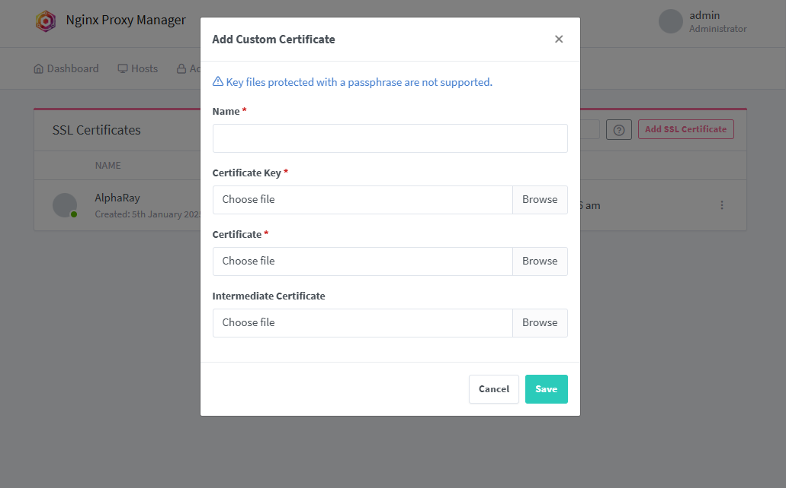

## 一、安装 certbot

Install system dependencies

```undefined
sudo apt update
sudo apt install python3 python3-venv libaugeas0
```

Set up a Python virtual environment

```
sudo python3 -m venv /opt/certbot/
sudo /opt/certbot/bin/pip install --upgrade pip
```

Install Certbot

```
sudo /opt/certbot/bin/pip install certbot certbot-nginx
```

Prepare the Certbot command

```
sudo ln -s /opt/certbot/bin/certbot /usr/bin/certbot
```

## 二、申请证书

```
certbot certonly  -d *.alpharay.space --manual --preferred-challenges dns --server https://acme-v02.api.letsencrypt.org/directory
```


输入邮箱地址，同意条款等（输入 y ），然后就需要去域名解析那边配置一个 txt 解析记录（dnspod 控制台）

```
Press Enter to Continue
Waiting for verification...
Resetting dropped connection: acme-v02.api.letsencrypt.org
Cleaning up challenges
Subscribe to the EFF mailing list (email: wangwen135@gmail.com).
Starting new HTTPS connection (1): supporters.eff.org

IMPORTANT NOTES:
 - Congratulations! Your certificate and chain have been saved at:
   /etc/letsencrypt/live/alpharay.space/fullchain.pem
   Your key file has been saved at:
   /etc/letsencrypt/live/alpharay.space/privkey.pem
   Your certificate will expire on 2024-08-13. To obtain a new or
   tweaked version of this certificate in the future, simply run
   certbot again. To non-interactively renew *all* of your
   certificates, run "certbot renew"
 - If you like Certbot, please consider supporting our work by:

   Donating to ISRG / Let's Encrypt:   https://letsencrypt.org/donate
   Donating to EFF:                    https://eff.org/donate-le
```

证书存储在 `/etc/letsencrypt/live/yourdomain.com`​ ，申请成功！

## 三、在 Nignx 中配置

登录 Nignx 后台，在 SSL certificates 中选择 Add SSL certificates - custom，将 privkey.pem 和 cert.pem 分别填入 Certificate Key 和 Certificate 中，即可使用证书。

​

‍
