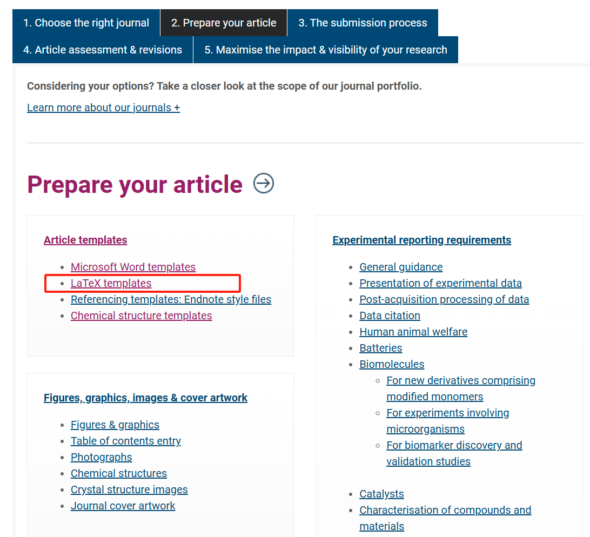
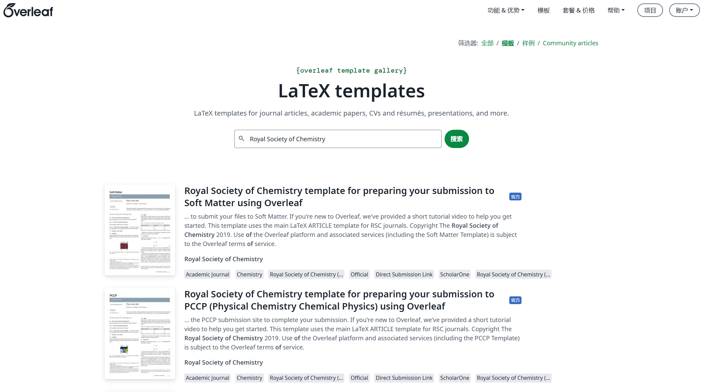
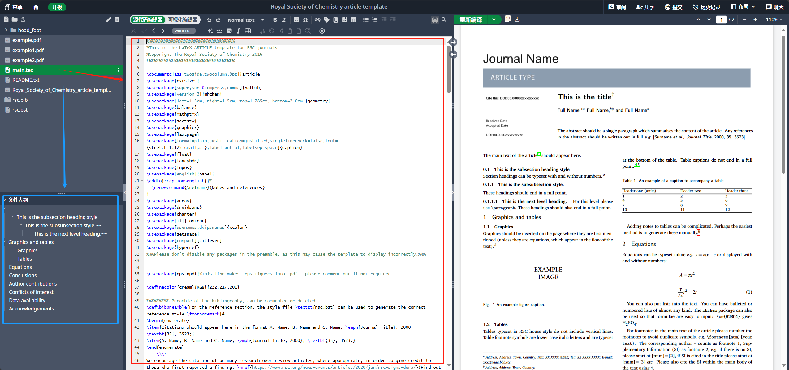

如果你熟悉一门编程语言以及 Markdown 标记语言，使用 Latex 投稿文章是一个不错的选择。

## 一、期刊官网下载模板

    1. 因为我投的期刊出版社是英国皇家化学会（RCS），所以下载模板的地址为：[RSC文章投稿指南](https://www.rsc.org/journals-books-databases/author-and-reviewer-hub/authors-information/#prepare-article)。里面有 Latex、Word、Chemdraw文件的模板，我们下载 Latex，是一个 zip 包

    ​​

    2. zip 包中的文件有如下文件：

    ```sh
    royal-society-of-chemistry-article-template.zip
    └ head_foot		# 出版社图片/格式文件，不用动
    	└ dates.pdf
    	└ DOI.pdf
    	└ header_bar.pdf
    	└ journal_name.pdf
    	└ LF.pdf
    	└ RF.pdf
    	└ RSC_LOGO_CMYK.eps
    	└ RSC_LOGO_CMYK.pdf
    	└ RSC_pub.pdf
    └ example.pdf		# main.tex 中的示例图片，可删除。
    └ example1.pdf		# main.tex 中的示例图片，可删除。
    └ example2.pdf		# main.tex 中的示例图片，可删除。
    └ main.tex			# Latex 文件，文章正文，是我们主要编辑的文件
    └ README.txt		# 使用指南
    └ Royal_Society_of_Chemistry_article_template.pdf	# 使用 main.tex 预编译的 pdf 文件
    └ rsc.bib			# 引用文献，需要编辑
    └ rsc.bst			# 引用文献参考格式，不用动
    ```

## 二、 在本地或在线编辑 Latex 文件
    
    1. 本地编辑需要安装 Latex 环境（[texlive](https://mirrors.tuna.tsinghua.edu.cn/CTAN/systems/texlive/ "https://mirrors.tuna.tsinghua.edu.cn/CTAN/systems/texlive/")）和软件（[TexStudio](https://mirrors.tuna.tsinghua.edu.cn/github-release/texstudio-org/texstudio/ "https://mirrors.tuna.tsinghua.edu.cn/github-release/texstudio-org/texstudio/")），网上有很多教程，这里不再赘述。我推荐使用在线编辑 Latex 网站 [Overleaf](https://cn.overleaf.com/ "https://cn.overleaf.com/")，不需要配置环境和软件，只需要注册账号即可。Overleaf 有在线的模板，也可使用下载的 royal-society-of-chemistry-article-template.zip 创建项目。

    ​​

    2. 使用模板创建项目后，使用 Overleaf 在线编辑 main.tex 文件，如所示，左边是文件结构和文件内容大纲，中间是工作区，右边是编译的 pdf 预览图。由于 Latex 排版是所见和所得相分离，我们编辑 main.tex 完查看效果需要编译才能看到更改后的 pdf 文件效果。

    ​​
    3. 理解 main.tex 模板文件，在文件中出版商已经写好了每部分的格式和内容，用 %%%% 分隔，格式部分会注明：`Please do not change any commands within this section`​。main.tex 文件每个部分包括：

    ```txt
    %%%%%%%%%%%%%%%%%%%%%%%%%%%%%%%%%%%
    %This is the LaTeX ARTICLE template for RSC journals
    %Copyright The Royal Society of Chemistry 2016
    %%%%%%%%%%%%%%%%%%%%%%%%%%%%%%%%%%%
    ...... 		# 不要禁用任何在导言区（preamble）加载的包，不用动
    %%%Please don't disable any packages in the preamble, as this may cause the template to display incorrectly.%%%%
    ......		# 不要禁用任何在导言区（preamble）加载的包，不用动
    %%%%%%%%% Preamble of the bibliography, can be commented or deleted
    ......		# 参考文献部分，我们在 rsc.bib 文件中编辑，这里不用动
    \begin{document}
    .......		# 文档的开始，所有的正文内容将从这里开始
    %%%HEADER%%%
    .......		# 页眉设置：页眉包含期刊的名称、期刊的 LOGO 等元素
    %%%PAGE SETUP - Please do not change any commands within this section%%%
    .......		# 页面设置：定义了文档的页面布局，例如边距、字体大小、行间距等设置。
    %%%FOOTER%%%
    .......		# 页脚设置：定义了页脚内容，包括页码、版权信息、期刊标识等。
    %%%FIGURE SETUP - please do not change any commands within this section%%%
    .......		# 图形设置：定义了图形的排版方式，例如图形插入时的间距、图形边框等。
    %%%TITLE, AUTHORS AND ABSTRACT%%%
    .......		# 需要编辑的标题、作者和摘要部分
    %%%FONT SETUP - please do not change any commands within this section
    .......		# 字体设置：定义了文档中使用的字体、大小、样式等。
    %%%FOOTNOTES%%%
    .......		# 脚注：定义文章中的脚注。常用提供附加信息或解释，如作者的机构、通讯作者的联系方式、补充信息等。
    %%%MAIN TEXT%%%%
    .......		# 正文部分：文章的核心部分。
    %%%REFERENCES%%%
    .......		# 参考文献设置，使用 BibTeX 文件来管理参考文献
    \end{document}		# 结束文档
    ```
    4. . 将 Word 编辑完的手稿填入 main.tex 文件中。可以看出，我们只需要编辑：标题作者摘要部分、脚注部分、正文内容、参考文献（rsc.bib 文件） 这四个部分。main.tex 文件中已经贴心的写好了很多部分的注释，以 % 开头，比如 `%The abstrast goes here instead of the text "The abstract should be..."`​ 只需要按照提示，将模板中的内容替换掉即可。

    > 也可将写好的 Word 手稿使用文件转换为 Latex 格式，有很多在线网站和软件又可以使用。
    >
## 三、对内容格式的简单介绍
     对于熟悉 Markdown 标记语言的人来说，Latex 有很多相同的地方，一般投稿文章需要文本、图片、表格、公式、代码等元素，这里简做介绍。

    1. 文本正常输入即可，有些符号需要加转义符号 `\`​ 才能正常显示，比如 `%`​ 在 Latex 中表示 注释，需要加 `\%`​ 才能显示为 `%`​ ，此外，还有加粗`\textbf{加粗}`​ 、斜体`\textit{斜体}`​、上标`^`​、下标`_`​、下划线`\underline{带下划线}`​等等格式，可以询问 GPT。
    2. 图片：有单列图和全宽图，图片文件格式为 .pdf 或者 .eps（使用 PhotoShop 或者 AdobePDF 可导出）

        ```txt
        \begin{figure}[h]
            \centering
            \includegraphics[width=0.5\textwidth]{example-image-a} % 替换为你的图片路径
            \caption{这是一个例子图片。}
            \label{fig:example1}
        \end{figure}
        ```
    3. 表格：有单列表格和全宽表格

        ```txt
        \begin{table}[h]
            \centering
            \begin{tabular}{|c|c|}
                \hline
                列1 & 列2 \\
                \hline
                数据A & 数据B \\
                数据C & 数据D \\
                \hline
            \end{tabular}
            \caption{这是一个例子表格。}
            \label{tab:example1}
        \end{table}
        ```
    4. 公式：分为行内公式 `$$`​ 和独立公式

        ```txt
        \begin{equation}
            E = mc^2
            \label{eq:einstein}
        \end{equation}
        ```
    5. 代码：行内代码和独立代码

        ```txt
        \begin{lstlisting}[language=Python, caption=Python 示例代码, label=lst:python_example]
        print("Hello, world!")
        \end{lstlisting}
        ```

## 四、插入参考文献
     使用任何可以生成 BibTeX 格式的参考文献文件，将内容复制到 rsc.bib 文件中然后编译完成后，在 main.tex 使用 `\cite{}`​ 命令引用文献，Latex 会自动生成序号以及 Bibliography

‍
