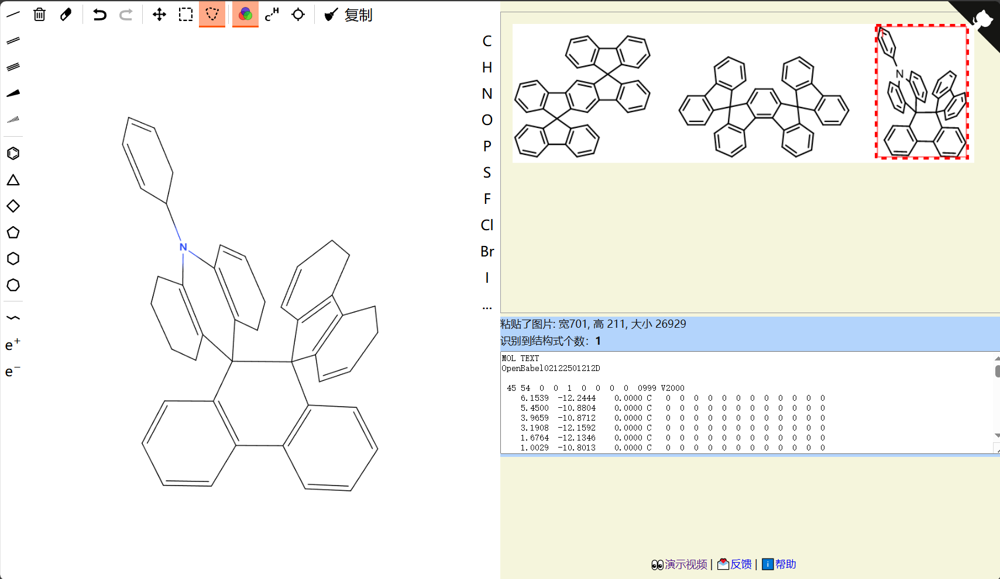

molOCR 开源项目可以将图片转化学结构，对科研工作者极为方便。很多商业软件也可以实现这个功能，但是一般都需要登录和氪金。感谢开源项目：[molOCR](https://github.com/def-fun/molOCR) （前端）以及 [chembl_beaker](https://github.com/def-fun/chembl_beaker) （后端）



本课题组有量化计算用的服务器，在网上刷到 [纯白纱陵](https://bane-dysta.github.io/) 博客文章：[利用molOCR截图识别文献中的结构](https://bane-dysta.github.io/posts/23/)，故在本地部署 molOCR 。由于课题组服务器是在校园网内，有不同网段，做端口转发，中间遇到了一些问题并解决，特来记录。

## 一、后端 `chembl_beaker`​ 部署

### 1. 拉取项目

默认你的 Linux 已经安装 docker 以及 root 登录 SSH。

```bash
# 新建文件夹
mkdir -p ./docker/molOCR && cd ./docker/molOCR

# 下载项目
wget https://github.com/def-fun/chembl_beaker/archive/refs/heads/master.zip
unzip chembl_beaker-master.zip
cd chembl_beaker-master
```

在这里，我的 docker 版本为 `Docker version 27.3.1, build ce12230`​ 不能直接 Build 镜像，否则 env 环境变量不能读取，出现 `warning`​ 导致识别识别失败。

询问 deepseek：将 Dockerfile 复制为 Dockerfile_backpack，然后修改 Dockerfile （将 ENV ~ 后面加 = ）内容为：

```dockerfile
FROM debian:bookworm-slim

ENV PYTHONUNBUFFERED=1

# install required ubuntu packages
RUN apt-get update --fix-missing && \
    apt-get install -y --no-install-recommends ca-certificates libxrender1 libxext6 wget bzip2 osra libopenbabel7 libpotrace0 && \
    apt-get -qq -y autoremove && \
    apt-get autoclean && \
    rm -rf /var/lib/apt/lists/* /var/log/dpkg.log

# install miniconda
RUN wget --quiet https://repo.continuum.io/miniconda/Miniconda3-4.7.12.1-Linux-x86_64.sh -O ~/miniconda.sh && \
    /bin/bash ~/miniconda.sh -b -p /opt/conda && \
    rm -rf $HOME/conda/pkgs/* && \
    rm ~/miniconda.sh

# add conda bin to path
ENV PATH=/opt/conda/bin:$PATH

# use the environment.yml to create the conda env
COPY environment.yml /tmp/environment.yml

# create the conda env using saved environment file
RUN conda env create -n chembl-beaker -f /tmp/environment.yml

# activate env (add conda env bin to path)
ENV PATH=/opt/conda/envs/chembl-beaker/bin:$PATH

# copy beaker and config file
COPY src/chembl_beaker chembl_beaker
COPY beaker.conf beaker.conf

ENTRYPOINT [ "python", "chembl_beaker/run_beaker.py", "-p", "beaker.conf" ]
```

### 2. 构建镜像

然后运行 `docker build --no-cache -f Dockerfile -t my_chembl_beaker:v1.2 .`​ 这时候又会出现：`debian:bookworm-slim: failed to resolve source metadata for docker.io/library/debian:bookworm-slim: failed`​ ，国内的网络访问不了docker.io，拉取不了 debian_bookworm_slim 镜像， 解决方法有两个：

1）对 docker 挂载镜像地址：`vim /etc/docker/daemon.json`​

```daemon.json
{
"registry-mirrors": [
"https://docker.hpcloud.cloud",
"https://docker.m.daocloud.io",
"https://docker.unsee.tech",
"https://docker.1panel.live",
"http://mirrors.ustc.edu.cn",
"https://docker.chenby.cn",
"http://mirror.azure.cn",
"https://dockerpull.org",
"https://dockerhub.icu",
"https://hub.rat.dev"
]
}
```

2）在能访问 `docker.io`​ 的Linux 使用 `docker pull debian:bookworm-slim && docker save -o debian_bookworm_slim.tar debian:bookworm-slim`​ 然后将 debian_bookworm_slim.tar 复制到本地，使用 `docker load -i debian_bookworm_slim.tar`​ 加载镜像

### 3. 运行 chembl_beake 后端

正常情况下，在 `docker build --no-cache -f Dockerfile -t my_chembl_beaker:v1.2 .`​ 之后就会有 my_chembl_beake 这个 docker 镜像，运行如下命令

```bash
root# docker run -p 5000:5000 my_chembl_beaker:v1.2

[07:40:10] Initializing Normalizer
CacheThrottle class can't work without cache...
Failed to load plugin beaker.plugins.throttling.Throttling because of error CacheThrottle class can't work without cache...
Caching plugin enabled but no cache backend configured, cashing will be skipped...
Bottle v0.12.18 server starting up (using GunicornServer(workers=4))...
Listening on http://0.0.0.0:5000/
Hit Ctrl-C to quit.

[2025-02-08 07:40:11 +0000] [1] [INFO] Starting gunicorn 20.0.0
[2025-02-08 07:40:11 +0000] [1] [INFO] Listening at: http://0.0.0.0:5000 (1)
[2025-02-08 07:40:11 +0000] [1] [INFO] Using worker: sync
[2025-02-08 07:40:11 +0000] [13] [INFO] Booting worker with pid: 13
[2025-02-08 07:40:12 +0000] [14] [INFO] Booting worker with pid: 14
[2025-02-08 07:40:12 +0000] [15] [INFO] Booting worker with pid: 15
[2025-02-08 07:40:12 +0000] [16] [INFO] Booting worker with pid: 16
```

‍

## 二、前端 `molOCR`​ 部署

### 1. 下载项目，运行

    ```bash
    git clone https://github.com/def-fun/molOCR.git
    unzip molOCR-master.zip && cd molOCR-master
    python -m http.server
    Serving HTTP on :: port 8000 (http://[::]:8000/) ...
    ```

这时候在 `./molOCR-master/js/img2mol.js`​ 配置文件中 `let OCR_API_URL = 'http://' + window.location.hostname + ':5000/image2ctab'; //根据实际情况修改 API 的地址`，实际上是不需要修改，它会自动识别服务器的 ip 地址，如果修改为 0.0.0.0 、 127.0.0.1 或者 localhost 反而和后端连不上（我也不知道为什么，可能是我服务器的问题）

### 2. molOCR 连接 chembl_beaker

    这时候需要让前端 molOCR 和 后端 chembl_beaker 握手，学校内网的 ip 地址为 42.244.25.5 ，通过端口转发，局域网内服务器的 ip 地址为 192.168.1.8。这时候转发 molOCR 网站的本地端口 8000 到学校内网（42.244.25.5），识别会出现 无法连接 42.244.25.5:5000 （chembl_beaker 的端口）
    
    将 chembl_beaker 的本地端口 5000 转发到学校内网（42.244.25.5），即可正常识别分子结构图片

## 三、设置为后台守护进程

将 molOCR 和 chembl_beaker 设置为后台守护进程，我将 chembl_beaker 设置为 docker compose up -d 但是有时出现不识别的情况，于是另辟蹊径，使用 systemd 服务实现

### 1. 后端 chembl_beaker

    ```bash
    sudo vim /etc/systemd/system/molocr-http.service
    
    [Unit]
    Description=MolOCR HTTP Server
    After=network.target
    
    [Service]
    ExecStart=/usr/bin/python -m http.server --directory /path/docker/chembl_beaker/molOCR
    WorkingDirectory=/path/docker/chembl_beaker/molOCR
    Restart=always
    User=jzq
    
    [Install]
    WantedBy=multi-user.target
    
    sudo systemctl daemon-reload
    sudo systemctl enable molocr-http.service
    sudo systemctl start molocr-http.service
    sudo systemctl status molocr-http.service
    ```

### 2. 后端 chembl_beaker

    ```bash
    sudo vim /etc/systemd/system/my_chembl_beaker.service
    
    [Unit]
    Description=My ChEMBL Beaker Service
    After=docker.service
    Requires=docker.service
    
    [Service]
    ExecStartPre=-/usr/bin/docker rm -f chembl
    ExecStart=/usr/bin/docker run -p 5000:5000 --name chembl my_chembl_beaker:v1.2
    ExecStop=/usr/bin/docker stop $(/usr/bin/docker ps -q --filter ancestor=my_chembl_beaker:v1.2)
    Restart=always
    RestartSec=20
    
    [Install]
    WantedBy=multi-user.target
    sudo systemctl daemon-reload
    sudo systemctl enable my_chembl_beaker.service
    sudo systemctl start my_chembl_beaker.service
    sudo systemctl status my_chembl_beaker.service
    ```
