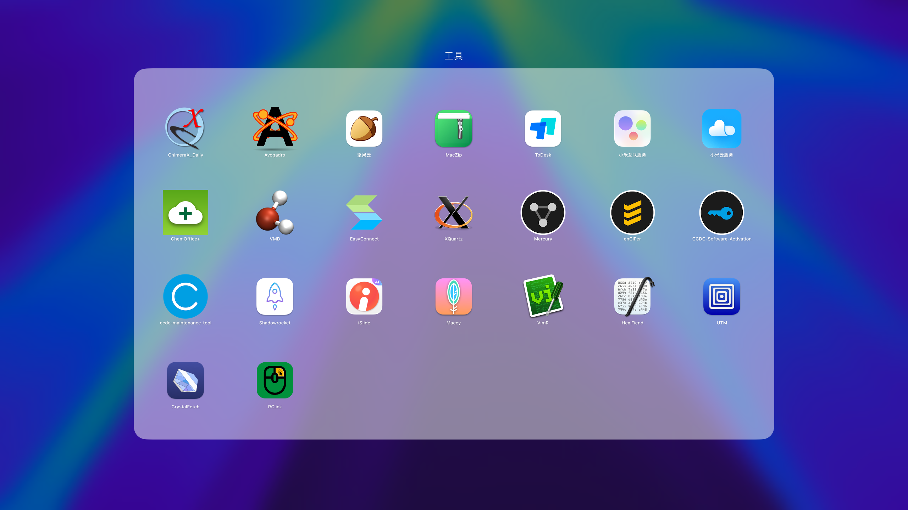

上周发现 Mac mini M4（16+256G） 国补 + 教育优惠只需要 2999 ¥ （官网 4499 ¥），我只能说这个价格太香了，果断下单体验一把 Mac 系统的生态。

作为一个科研人，在买之前其实我就知道 Mac 支持的软件没有 Windows 广泛，很多常用的软件，如 Origin、Gaussian、Material Studio、Chemdraw 3D等等软件都是缺失的。但是 Apple 的产品就是设计的很出众（硬件和软件都有独特的设计风格），而且 M4 可以说是 M 系列芯片最成熟的一代芯片，ARM 架构的功耗，X86 级别的性能，搭配 Mac mini 小巧的机身，只能说是迷你主机的标杆。

​​

实际使用下来，日常办公 2-5 W 的功耗，玩一些游戏（The WereCleaner）20 W 的功耗，对比我之前的主机（待机 60 W 运行游戏 200 W ）可以说是非常优秀，而且非常静音，几乎听不见风扇的声音。此外，M4 强大的单核性能，在日常办公使用体验明显（很多应用不会对多核进行优化，所以单核性能对使用感知的提升更为明显），几乎是文档、网页秒开，流畅无延迟。

苹果软硬件一体的发展思路，保证了多数应用在 Mac 平台都有着极好的适配，期待更多软件开发者加入到 Mac 的 ARM 生态中来。下面说一说我从 Windows 生态迁移到 Mac 使用到的一些应用分享。

---

## 一、需要虚拟机 / 远程桌面使用的应用

有些应用只有在 Windows 上面有，Mac 没有好的平替，建议使用虚拟机（parallels desktop 「贵、好用」、VMware Fusion「免费」、UTM「免费且开源」），或者远程桌面。虚拟机比较耗硬件资源以及硬盘，所以使用远程桌面更好些，替换下来的旧电脑不要扔，用一根网线接到局域网 / Mac 上面可以通过远程桌面操控、共享文件。

​​

1. Origin：科研绘图软件， Mac 虽然有平替软件，但是 Origin 已经使用习惯了。
2. MobaXterm：开源的 SSH 连接工具，现在使用 Mac 终端进行 SSH 连接，但是我还是要说 MobaXterm 很好用，
3. Material Studio：材料模拟软件
4. Chemdraw 3D：可以将 2D 结构变为 3D 结构。

## 二、需要 CrossOver 跨平台运行

CrossOver 是一种类虚拟机技术，但是不需要虚拟机这么大的硬件负担。CrossOver 会提供 Windows 应用程序所需的资源，包括系统库、API 和其他必要的组件。无需搭建完整的 Windows 系统环境，即可在 Mac 上直接使用 Windows X86 应用。几乎是原声体验，但是不是所有的应用都能模拟，比如 Origin 等这种比较大的软件就不行。

​​

1. Gaussian & Gaussian View：量子计算常用的软件。
2. Multiwfn：强大的波函数分析工具
3. POV-Ray：图像生成软件，科研绘图实用（AICD 磁感应电流密度）。

## 三、Mac 原生支持的软件

Mac 当然是原声的软件用起来最舒服，丝滑的体验，除了之前 Windows 上面用的应用，Mac 有些功能上的缺失，又在网上找了一些软件作为补充。

​​

1. VMD：.cub 格点文件绘图，做量化计算的经常用，可以直接加载到 Mac 终端到 zshrc，用起来和 Linux 环境差不多。
2. EasyConnect：连接校园网，直接在学校 VPN 网站下载。
3. ChemDraw：化学结构绘图，感觉不如 Windows 平台的好用，主要是不能嵌入 Word、PPT 里面编辑，而且没有套件，只有这一款。
4. Shadowrocket：科学上网。
5. UTM：开源的虚拟机软件，免费，但是不如 parallels desktop 好用，消耗硬盘和内存。
6. CrossOver：类虚拟机软件，前面提到过。
7. MacZip：解压软件，用着还不错。
8. Mercury：单晶分析软件。
9. Maccy：免费的剪贴板管理工具，可以记录剪贴板历史，包括文字和图片。
10. VimR：编辑文字软件，基于 Vim。
11. VLC：视频播放软件。
12. RClick：免费的右键工具，可以新建文件（为什么 Mac 没有自带这个功能！）
13. SiYuan 笔记：开源软件，最适合我的笔记工具，Notion 平替。
14. Zotero：非常好用的文献管理软件。
15. Windows APP：管理 Windows 远程桌面的工具（Remote Desk），不知道为什么要换这个名字。
16. Word、Excel、Power Point、Edge：和在 Windows 下使用没什么区别，甚至更好用一些。

还有一些日常用的其他软件就不多介绍了，什么，你说还有游戏，买了 Mac 就不要想着打游戏了（其实也有一些，但是还是 Steam 和 Epic 香）
