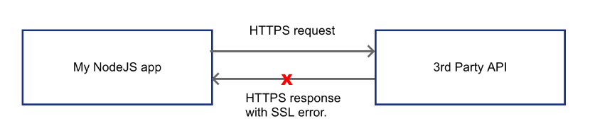

在更换 SSL 证书后，Logto 控制台出现 Internal server error.

参考：Chat GPT，[Emmanuel Corrales](https://emcorrales.com/blog/nodejs-debugging-and-fixing-https-ssl-issues-caused-by-changing-the-self-signed-certificate). 

## 一、报错与排查：

课题组登录的 lobe chat database （GPT 代理网站）由 Logto 作为鉴权应用，前几日更换了 Let's encrypt 颁发的证书，发现 Logto 登录页面无法访问，访问控制台出现 Internal server error. 查看 docker 日志有：

```log
[cause]: Error: unable to verify the first certificate
      at TLSSocket.onConnectSecure (node:_tls_wrap:1677:34)
      at TLSSocket.emit (node:events:518:28)
      at TLSSocket._finishInit (node:_tls_wrap:1076:8)
      at ssl.onhandshakedone (node:_tls_wrap:862:12) {
    code: 'UNABLE_TO_VERIFY_LEAF_SIGNATURE'
```

询问 GPT 给出的答案均为 `在 SSL/TLS 连接过程中，客户端无法验证服务器证书的有效性`​ ，由于能够正常访问其他该 SSL 证书加密的网站，我第一反应是 Logto 缓存中停留的上一份 SSL 证书与当前证书不匹配。在仔细研究 Logto 的部署文档，重新调试了 docker 容器均无果，于是在 bing 上搜索。在 https://emcorrales.com/blog/nodejs-debugging-and-fixing-https-ssl-issues-caused-by-changing-the-self-signed-certificate 找到了类似问题的原因。

​![[image-20250107085331-b9z89l3.png]]​

根据测试 SSL 命令有：

```shell
root$ openssl s_client -connect api.example.com:443

...
    Start Time: 1736184337
    Timeout   : 7200 (sec)
    Verify return code: 21 (unable to verify the first certificate)
    Extended master secret: no
    Max Early Data: 0
---
read R BLOCK
```

可以发现与 docker 日志中出现了相同的 `unable to verify the first certificate`​ ，证明是 SSL 的问题。

## 二、解决：

查看之前的 nginx SSL 证书文件发现，之前的证书文件夹都是 4 个文件，而新安装的证书只有两个文件`cert.pem privkey.pem`​  。

于是将申请证书生成的 `cert.pem chain.pem fullchain.pem privkey.pem`​ 四个文件拷贝到 nginx docker 挂载的证书目录中 `./nginx/data/custom_ssl/npm-27`​ ，重启 docker 容器，问题解决 ~

> cert.pem（有时也称为 server.crt 或 public.crt）: 这个文件包含了你的公钥证书，也就是由证书颁发机构(CA)签名的数字证书。它用来证明网站的身份，并且包含公钥，客户端可以用这个公钥来加密与服务器之间的通信。
>
> chain.pem（有时也称为 ca_bundle.crt）: 该文件包含了中间证书链，这些证书链接了你的证书(cert.pem)到CA的根证书。不是所有的情况都需要这个文件，取决于CA和你所使用的证书类型。但是，提供完整的证书链可以确保浏览器能够验证你的证书，从而顺利完成SSL/TLS握手。
>
> fullchain.pem : 这个文件是一个组合文件，它将你的证书(cert.pem)和整个证书链(chain.pem)合并到了一个文件中。使用这个文件可以让服务器更容易地配置SSL/TLS，因为只需要指定一个文件即可提供所有的证书信息。
>
> privkey.pem（有时也称为private.key）: 这个文件包含了与你的公钥证书相对应的私钥。私钥用于解密用公钥加密的数据，并且在建立安全连接时进行身份验证。私钥必须严格保密，不应该泄露给任何人。

‍
