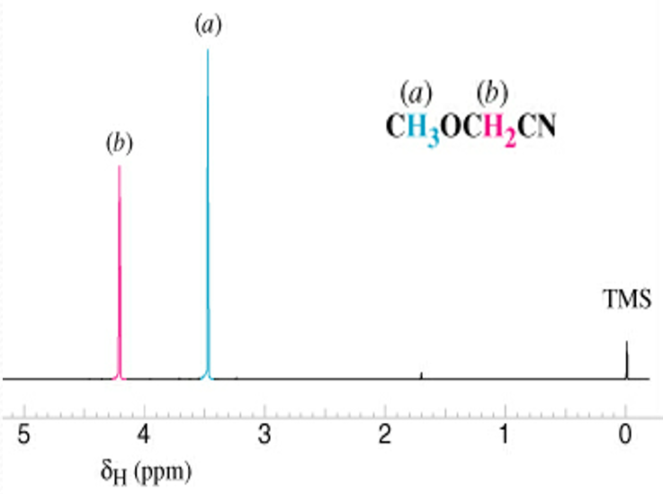
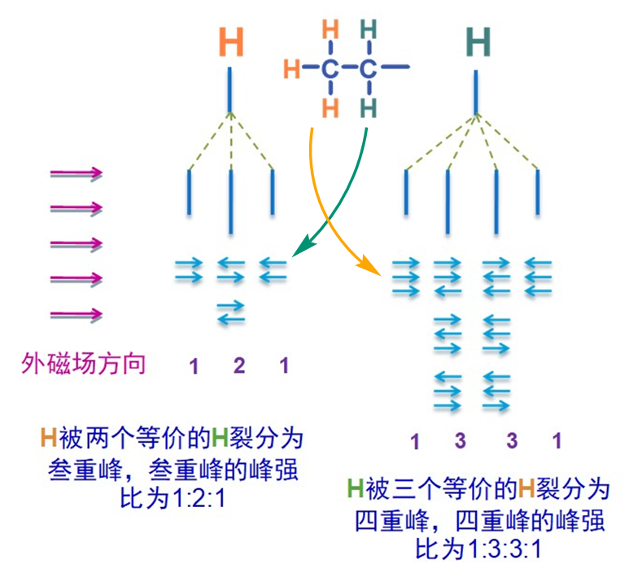
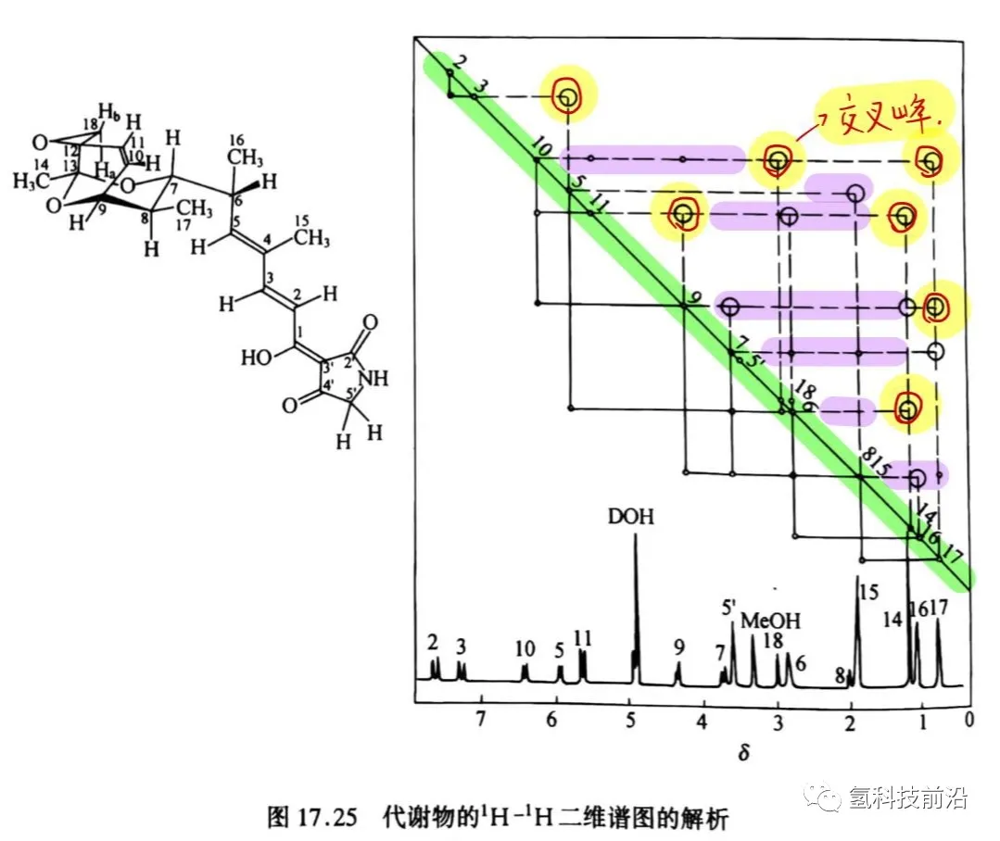

## 一、核磁共振原理

1. 氢原子的磁性：氢原子具有磁性，当处于外加磁场中时，氢原子核（质子）的自旋轴会趋向于与磁场方向一致或相反，产生不同的能量状态（能级裂分）。

   ​​
2. 共振吸收：如果用特定频率的电磁波（能量激发）照射处于磁场中的氢原子核，当射频场的能量恰好等于氢原子核在不同能量状态之间的能量差时，氢原子核就会通过共振吸收电磁波的能量，从低能态跃迁到高能态。

   ​​
3. 化学位移：由于分子中电子云对外加磁场强度有影响，处于分子结构中不同位置的氢原子实际感受到的磁场强度不同，因而它们发生共振吸收时所需的射频场频率也不同，在图谱上出现的位置就有差异（化学位移）。

   ​​

‍

## 二、一维核磁分析

1. 化学位移：判断氢原子的类型和所处的化学环境。连接在不同官能团上的氢原子，由于周围电子云密度不同，会有不同的化学位移值。
2. 峰面积与氢原子数目：在 1H-NMR 谱上，各吸收峰覆盖的面积与引起该吸收的氢核数目成正比。峰面积常以积分曲线高度表示，积分曲线总高度相当于氢核的总个数，每一相邻水平台阶高度则取决于引起该吸收的氢核数目。通过测量峰面积或积分值，可以推断出不同化学环境下氢原子的相对数目。
3. 自旋 - 自旋耦合和裂分：相邻碳上质子之间存在自旋偶合作用，会引起吸收峰裂分。例如，一个质子共振峰若不受相邻质子的自旋偶合影响，表现为一个单峰；若受其影响，就可能表现为一个二重峰（强度相等，总面积和未分裂的单峰面积相等），或者更复杂的多重峰。耦合常数（用 *J* 表示）可以表明核与核之间的关系。

   ​​

## 三、识别二维 1H-1H 核磁谱图

1. 二维核磁谱图用于分析分子中氢原子之间的空间关系和连接性：对于二维 1H-1H 核磁谱图，横纵坐标都是信号相同的一维的 H 谱（可以理解微 $y=x$ ），图上的对角线信号则表示自身出现的耦合作用（ $y_n∽x_n$ ）。而重点是其他位置交叉出现的信号，即表示两种不同的 H 存在自旋 - 自旋耦合裂分作用（ $y_n∽x_m$ ）两种 H 在分子结构上相邻（近）。
2. 举个 🌰：下面两张图是两个物质的二维 H-H 核磁谱图实线连接点为相同氢的偶合，而虚线的连接点为交叉峰表示相邻氢之间的偶合，更为重要些。
   ​​

   ​​

注意：

1. 有时对于较远的偶合也会出现相关峰。因此，显示相关峰的核之间不一定就是相隔三根键。​
2. 偶合常数 *J* 为零的 H 之间不出现相关峰。因此，不出现相交峰的 1H 核之间也有可能是相邻的（对称性环境中的等价氢）。

‍

参考资料：

> https://blog.csdn.net/Allenkx/article/details/135605859

‍
